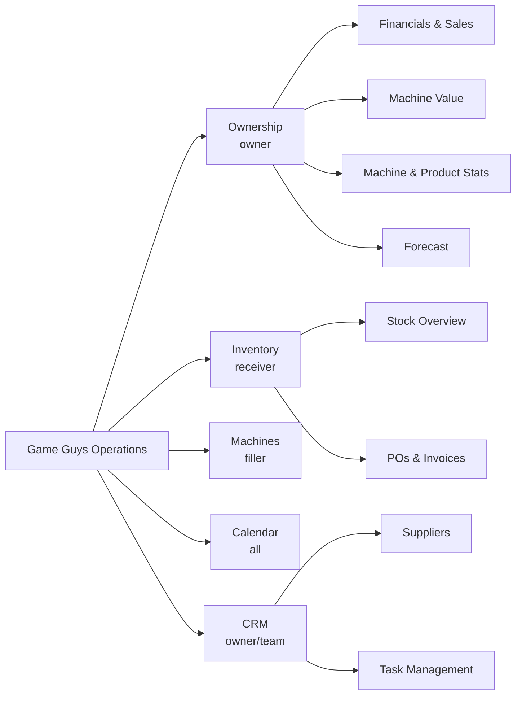
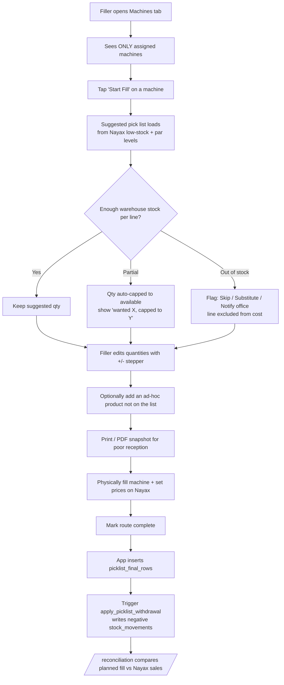
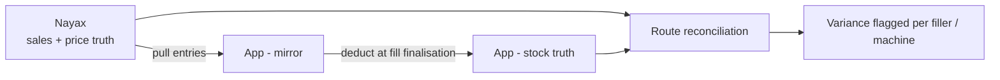
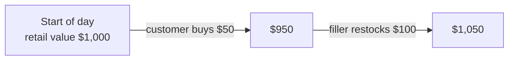
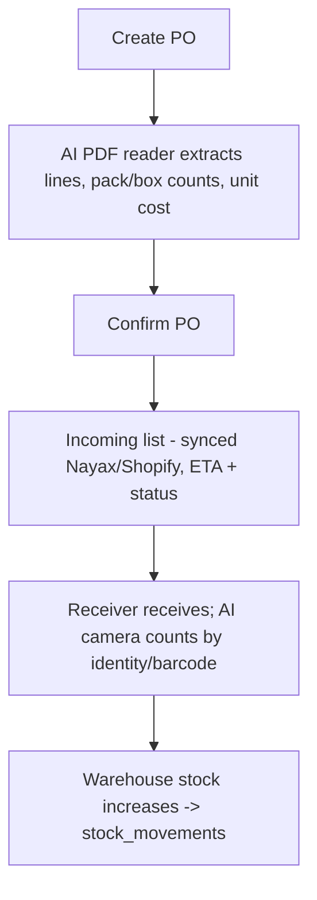

# Game Guys Operations — Build Plan & Flow Spec

> **Purpose:** This is a handoff document for the developer + their AI coding assistant.
> Paste it into the AI alongside the codebase so it understands the intended information
> architecture, screen behaviours, data flows, and business rules. Use the **live prototype**
> as the visual reference — this doc is the source of truth for *behaviour*.

**Live prototype:** https://josh441.github.io/gameguys-proposed-ui/
**Screens:** `ownership.html` · `inventory.html` · `machines.html` · `miscellaneous.html` (Calendar) · `crm.html`

---

## 0. Golden rules (read first)

1. **Do not rebuild what already exists — surface it.** The app already has Xero sync, Shopify/Nayax
   syncs, PDF PO/invoice extraction, release calendar, supplier contacts, task assignment + notify,
   and warehouse auto-deduct. This plan reorganises and exposes those; it does not duplicate them.
2. **Source of truth is split:**
   - **Nayax = sales & price truth.** The app *mirrors* Nayax; fillers price/update on Nayax, we pull.
   - **App = stock truth.** Stock is deducted when a fill is finalised, then reconciled against Nayax sales.
3. **Auto-deduct already works** via the `picklist_final_rows` insert trigger
   (`apply_picklist_withdrawal()`) → creates a negative `stock_movements` row → surfaced in `/reconciliation`.
   **Do NOT add a second deduction path** (e.g. from the filler hub) or stock will double-count.
4. **Fillers are scoped** to their assigned machines only (individual `filler_machine_assignments`;
   route assignment is a bulk convenience that writes those rows).
5. Keep navigation to **5 top-level tabs**. Everything deeper is a sub-tab.

---

## 1. Navigation (information architecture)

Five top-level tabs. Sub-views are tabs *inside* a screen, not new sidebar entries.

**Role → default tab / visibility**

| Role | Lands on | Can see |
|------|----------|---------|
| Owner / Admin | Ownership | everything |
| Receiver / Warehouse | Inventory | Inventory, Calendar, Machines (read), CRM tasks |
| Filler | Machines | Machines (own), Calendar |

---

## 2. Screen specs

### 2.1 Ownership (owner)
Curated business view. **Surface Xero data, don't rebuild the P&L.**

- **Financials & Sales:** KPIs (total sales all channels, net profit, gross margin, stock spend,
  cash-in-stock, cash flow); sales trend chart split by channel (vending vs online);
  sales-by-channel donut; stock spend by language (EN/JP/CN); curated Xero P&L
  (COGS, opex, fixed, import taxes → net profit). *Limit to what owners actually need.*
- **Machine Value:** see §3.3 (live cost vs retail per machine).
- **Machine & Product Stats:** machines best→worst by net profit; best product per top machine;
  top-10 and bottom-10 products by net profit.
- **Forecast:** projected revenue / recommended stock spend / projected profit; recommended actions;
  scenario planner (conservative / recommended / aggressive spend).

### 2.2 Inventory (receiver)
- **Stock Overview:** current on-hand (live from Nayax + warehouse), incoming stock (synced from
  Nayax + Shopify) with ETA + status, low/out-of-stock flags, dead/slow-stock aging.
  **AI stock camera:** recognise product identity or barcode and auto-count on receiving/stocktake.
- **POs & Invoices:** PO list with per-**pack** cost (TCG) or per-**box**/unit cost (blind boxes/snacks);
  **AI PDF reader** extracts line items, pack/box counts and prices from a dropped quote/invoice.

### 2.3 Machines (filler) — see §3.1 for the flow
- KPIs: machines assigned, urgent fills, last Nayax sync.
- Machine cards (status: urgent/low/good, favourite, location, products-to-fill, est. time).
- **Flexible pick list** (the important part): warehouse-aware, editable, handles out-of-stock.
- Bottom bar: Sync to Nayax · Mark route complete · Print/PDF (bad reception) · total est. cost.

### 2.4 Calendar (all)
Release calendar grouped by month: product, set code, language, preorder status. "Action needed"
list for releases without secured stock. (Feature already exists — just relocate under this tab.)

### 2.5 CRM (owner/team)
- **Suppliers:** contact only — name, phone, email, products ordered, terms, rating.
  **Never store login credentials / passwords.**
- **Task Management:** create + assign a task → assignee is notified (existing `pingAssignee` →
  `notifyUser`). Board columns: To do / In progress / Done.

---

## 3. Core flows

### 3.1 Filler fill workflow (with flexible pick list)

**Pick list UI states (per line):** `in_stock` (green) · `partial` (amber, qty capped) ·
`out_of_stock` (red, disabled qty + Skip/Substitute/Notify).
**Rule:** the hub does NOT deduct stock itself — deduction happens only at "Mark route complete"
through the existing `picklist_final_rows` path (see Golden Rule #3).

### 3.2 Source of truth

### 3.3 Machine Value (live cost vs retail)

Each machine tracks **cost** (what we paid) and **retail** (what it sells for). Value recomputes on
every sale (down) and restock (up). No manual entry.

- `machine_value_retail = Σ(unit_qty × selling_price)` per machine.
- `machine_value_cost   = Σ(unit_qty × unit_cost)` per machine.
- `margin = (retail − cost) / retail`.
- **Decrease** on a Nayax sale (pulled): reduce qty of sold SKU → recompute.
- **Increase** on a fill/restock: `stock_movements` into machine → recompute.
- Portfolio totals = sum across machines. Show "today's change" (▲ restocked / ▼ sold).

### 3.4 Inventory receiving (with AI)

### 3.5 Task assignment

---

## 4. Data model (existing + additions)

**Existing (reuse):**
- `routes`, `routes.assigned_user_id`
- `machines`
- `filler_machine_assignments` — **the scoping source of truth** for fillers
- `stock_movements` — every stock change (restock/sale/adjustment) with signed `qty_delta`
- `picklist_upload_pulls`, `picklist_final_rows` — final upload + `apply_picklist_withdrawal()` trigger
- `products` + `products_naming_parts` (set_code / series_name / language)
- Xero, Shopify, Nayax sync tables; supplier + task tables

**Likely additions for this plan:**
- Par-level / suggested-fill config per machine+product (drives the suggested pick list).
- Selling price per SKU (mirrored from Nayax) + unit cost (from PO) → powers **Machine Value**.
- Machine-value snapshot/materialised view (or computed on read) for fast portfolio totals.
- Out-of-stock flag / substitution note captured at fill time (so the office sees reorder needs).

---

## 5. Build phases

1. **Navigation reshape** — 5 tabs + sub-tabs; role-based default landing + visibility. Low risk.
2. **Flexible pick list** — warehouse-aware quantities, out-of-stock flags, ad-hoc add, print.
   Reuse existing final-upload/deduct path; add UI + par levels. Do not add a second deduct.
3. **Machine Value** — join qty × (cost, selling price); recompute on sale-pull + restock; Ownership sub-tab.
4. **Inventory polish** — surface incoming + AI PDF reader on PO form; scope AI camera (identity/barcode).
5. **CRM/Calendar** — relocate existing supplier + task + release-calendar features under new tabs.

---

## 6. Non-negotiables / gotchas

- Fillers must never see machines they aren't assigned to.
- Stock deducts exactly once (at fill finalisation) — reconciled against Nayax, never double-count.
- Nayax pricing is authoritative; the app displays/pulls, it does not push prices as truth.
- No supplier credentials stored — contact details only.
- Keep owner financials curated (surface Xero essentials, not a full accounting rebuild).
