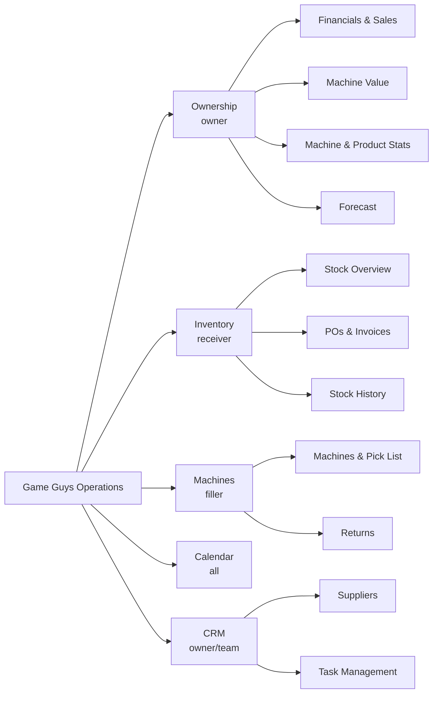
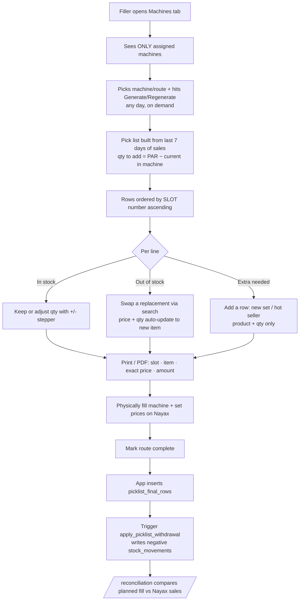
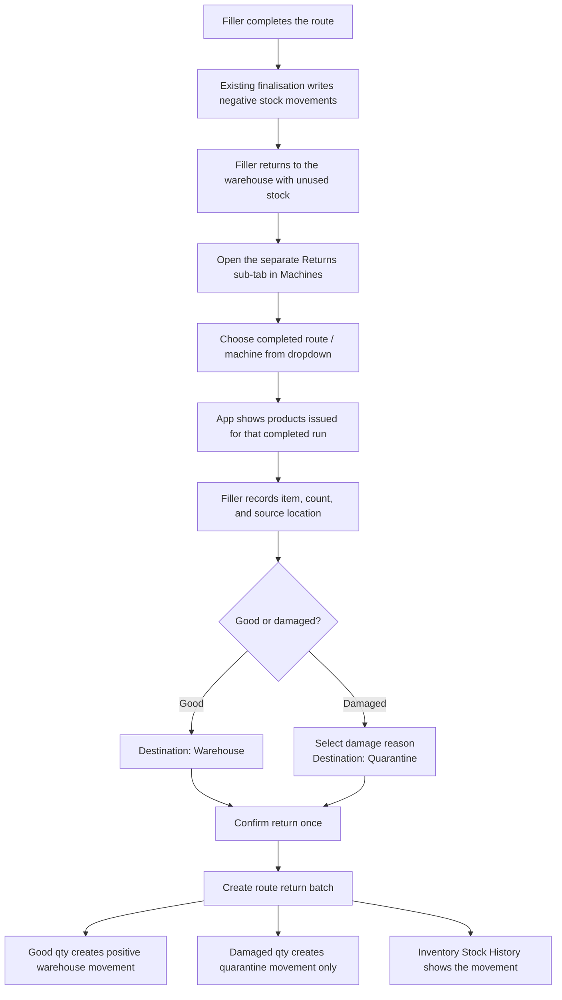
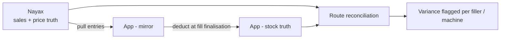
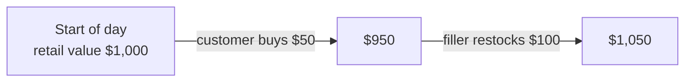
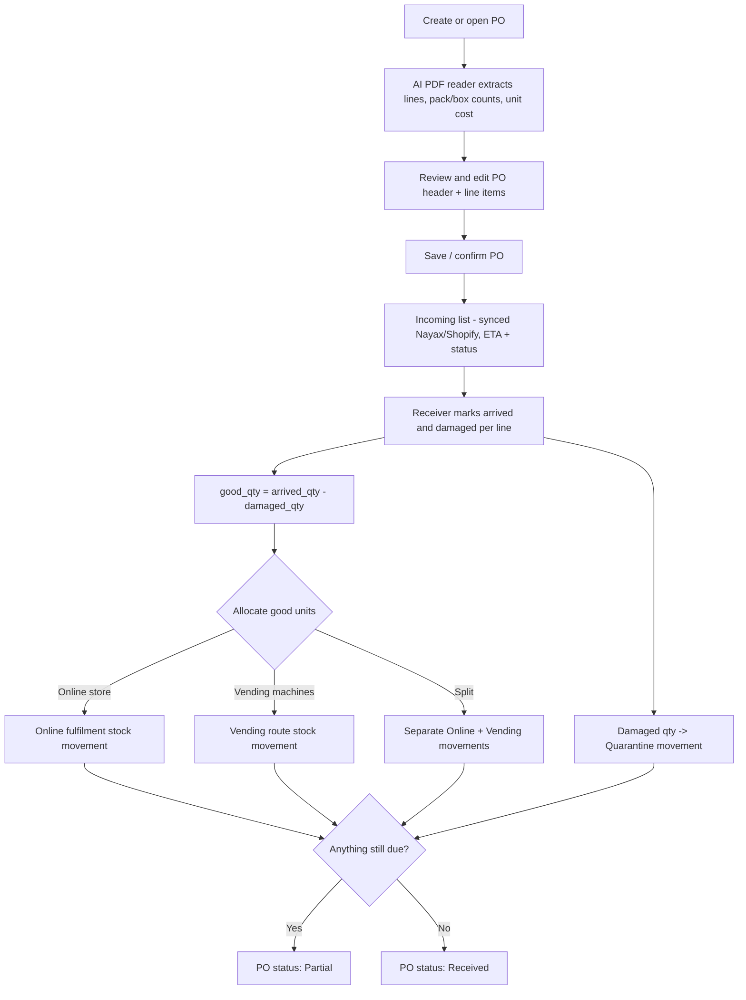

# Game Guys Operations — Build Plan & Flow Spec

> **Purpose:** This is a handoff document for the developer + their AI coding assistant.
> Paste it into the AI alongside the codebase so it understands the intended information
> architecture, screen behaviours, data flows, and business rules. Use the **live prototype**
> as the visual reference — this doc is the source of truth for *behaviour*.

**Live prototype:** https://josh441.github.io/gameguys-proposed-ui/
**Screens:** `ownership.html` · `inventory.html` · `machines.html` · `miscellaneous.html` (Calendar) · `crm.html`

---

## 0. Golden rules (read first)

1. **Do not rebuild what already exists — surface it.** The app already has Xero sync, Shopify/Nayax
   syncs, PDF PO/invoice extraction, release calendar, supplier contacts, task assignment + notify,
   and warehouse auto-deduct. This plan reorganises and exposes those; it does not duplicate them.
2. **Source of truth is split:**
   - **Nayax = sales & price truth.** The app *mirrors* Nayax; fillers price/update on Nayax, we pull.
   - **App = stock truth.** Stock is deducted when a fill is finalised, then reconciled against Nayax sales.
   - ✅ **Confirmed available from Nayax:** per-machine, per-SKU **last-7-day sales**, successful sale history, and **selling price**.
     This powers pick-list generation (`qty_to_add`), the last-sold price reference, the pace figures, and Machine Value.
3. **Auto-deduct already works** via the `picklist_final_rows` insert trigger
   (`apply_picklist_withdrawal()`) → creates a negative `stock_movements` row → surfaced in `/reconciliation`.
   **Do NOT add a second deduction path** (e.g. from the filler hub) or stock will double-count.
4. **Fillers are scoped** to their assigned machines only (individual `filler_machine_assignments`;
   route assignment is a bulk convenience that writes those rows).
5. Keep navigation to **5 top-level tabs**. Everything deeper is a sub-tab.
6. **Unused route stock returns through one explicit positive movement.** After a route is completed,
   the filler can return unopened leftovers to Warehouse. The existing fill finalisation remains the
   only negative movement; the confirmed return writes one positive `stock_movements` row per product.
   The movement appears in the receiver's unified **Stock History**, but the receiver does not approve
   it again or create another movement. Good returns also appear immediately in Current stock.

---

## 1. Navigation (information architecture)

Five top-level tabs. Sub-views are tabs *inside* a screen, not new sidebar entries.


```mermaid
flowchart LR
  Root[Game Guys Operations] --> O[Ownership<br/>owner]
  Root --> I[Inventory<br/>receiver]
  Root --> M[Machines<br/>filler]
  Root --> C[Calendar<br/>all]
  Root --> R[CRM<br/>owner/team]

  O --> O1[Financials & Sales]
  O --> O2[Machine Value]
  O --> O3[Machine & Product Stats]
  O --> O4[Forecast]
  I --> I1[Stock Overview]
  I --> I2[POs & Invoices]
  I --> I3[Stock History]
  M --> M1[Machines & Pick List]
  M --> M2[Returns]
  R --> R1[Suppliers]
  R --> R2[Task Management]
```

**Role → default tab / visibility**

| Role | Lands on | Can see |
|------|----------|---------|
| Owner / Admin | Ownership | everything |
| Receiver / Warehouse | Inventory | Inventory, Calendar, Machines (read), CRM tasks |
| Filler | Machines | Machines (own), Calendar |

---

## 2. Screen specs

**Prototype content rule:** use Pokémon TCG products, releases, packaging, and suppliers for all
sample data so damage, pack/box quantities, and allocation decisions match the hobby business.

### 2.1 Ownership (owner)
Curated business view. **Surface Xero data, don't rebuild the P&L.**

- **Financials & Sales:** KPIs (total sales all channels, net profit, gross margin, stock spend,
  cash-in-stock, cash flow); sales trend chart split by channel (vending vs online);
  sales-by-channel donut; stock spend by language (EN/JP/CN); curated Xero P&L
  (COGS, opex, fixed, import taxes → net profit). *Limit to what owners actually need.*
- **Machine Value:** see §3.3 (live cost vs retail per machine).
- **Machine & Product Stats:** machines best→worst by net profit; best product per top machine;
  top-10 and bottom-10 products by net profit.
- **Forecast:** projected revenue / recommended stock spend / projected profit; recommended actions;
  scenario planner (conservative / recommended / aggressive spend).

### 2.2 Inventory (receiver)
- **Stock Overview:** current on-hand (live from Nayax + warehouse), incoming stock (synced from
  Nayax + Shopify) with ETA + status, low/out-of-stock flags, and an explicit allocation split between
  **Online store** fulfilment stock and **Vending machine** route stock. Never show these as one
  ambiguous “Store” bucket. Present current stock as a compact searchable table with language and
  allocation filters, name/language/on-hand sorting, and a **10 / 25 rows** selector. Do not show a
  stock-level or health graphic until the business defines the thresholds behind it.
  **AI stock camera:** a compact **Scan stock** action in the Inventory header opens the scanner on
  demand; do not reserve a dashboard card for it.
- **POs & Invoices:** PO list with **View / edit** and **Receive** actions. The edit workspace covers
  supplier, status, order/ETA dates, references, notes, and line-level item, SKU, ordered quantity,
  pack size, and unit cost. Per-**pack**, per-**booster box**, per-**bundle**, or per-**ETB** cost is
  used for Pokémon TCG products. The **AI PDF reader** extracts line items, pack/box counts, and prices from a dropped
  quote/invoice for review before save.
- **Receive delivery:** mark off `arrived now` and `damaged` per PO line, show good quantity and any
  quantity still due, then allocate every good unit to **Online store**, **Vending machines**, or a **split** of both.
  Damaged units go to **Quarantine** and never increase sellable inventory. Confirming the receipt
  changes the PO to `Partial` when quantities remain due or `Received` when the order is complete.
  Group each receiving row into only three work areas: **product + PO balance**, **this delivery +
  damage**, and **good-stock allocation**. Provide **Receive all outstanding** and **Clear this
  delivery** shortcuts; both must still respect quantity, damage, and allocation validation.

### 2.3 Machines (filler) — see §3.1 for the flow
- KPIs: machines assigned, urgent fills, last Nayax sync.
- Machine cards (status: urgent/low/good, favourite, location, products-to-fill, est. time).
- **Pick list** (the important part) — see §3.1a for full behaviour. Summary:
  - **Generated on demand** — the picker hits *Regenerate* any day for whichever machine/route
    they're prepping (not on a fixed schedule). Built from the **last 7 days of sales** per location,
    showing how much is missing per row.
  - **Working view rows are ordered by SLOT number ascending** (1,2,3…), *not* by urgency.
  - **Columns:** slot · product group · product name · current qty in machine · **PAR (capacity/size,
    shown beside the qty)** · qty to add · **last sold price from Nayax** with source machine/date · pace *(sales/wk + days-left,
    on-screen only — must NOT print)*.
  - **Editing is restricted to product + quantity only** (≈90% of runs need 0–2 changes):
    - Out-of-stock → **swap** a replacement via search/dropdown; the new **price and qty auto-update**.
    - **Add an extra row** (a new set or a hot seller) not on the generated list — product + qty only.
    - Qty is an inline stepper (manual override); everything else is locked.
- **Printout** — see §3.1b. Stripped to **slot · item · exact price · amount** and nothing else.
- **Returns sub-tab** — separate from **Machines & Pick List**. After the route is complete and the filler is back at the warehouse,
  show the **item**, editable **count**, explicit source **machine/location/route**, and a **Good /
  Damaged** condition choice. Good stock returns to Warehouse; damaged stock requires a reason and
  moves to Quarantine. Confirmation produces one route-linked return reference.
- Bottom bar: Confirm fills · Mark route complete · Return stock · Print/PDF (bad reception) · total est. cost.

On **Inventory**, use one running **Stock History** sub-view instead of a return-specific screen. It
shows PO receipts, route-fill withdrawals, allocation transfers, adjustments, damaged movements, and
route returns in the same newest-first ledger. The receiver can search and filter the ledger by
movement type and stock area. Good route returns update **Current stock → Warehouse · unallocated**
immediately and the history row shows the return reference, source, signed quantity, and resulting stock.

### 2.4 Calendar (all)
Release calendar grouped by month: product, set code, language, preorder status. "Action needed"
list for releases without secured stock. (Feature already exists — just relocate under this tab.)

### 2.5 CRM (owner/team)
- **Suppliers:** contact only — name, phone, email, products ordered, terms, rating.
  **Never store login credentials / passwords.**
- **Task Management:** create + assign a task → assignee is notified (existing `pingAssignee` →
  `notifyUser`). Board columns: To do / In progress / Done.

---

## 3. Core flows

### 3.1 Filler fill workflow (on-demand pick list)


```mermaid
flowchart TD
  A[Filler opens Machines tab] --> B[Sees ONLY assigned machines]
  B --> C[Picks machine/route + hits Generate/Regenerate<br/>any day, on demand]
  C --> D[Pick list built from last 7 days of sales<br/>qty to add = PAR − current in machine]
  D --> E[Rows ordered by SLOT number ascending]
  E --> F{Per line}
  F -- In stock --> G[Keep or adjust qty with +/- stepper]
  F -- Out of stock --> H[Swap a replacement via search<br/>price + qty auto-update to new item]
  F -- Extra needed --> J[Add a row: new set / hot seller<br/>product + qty only]
  G --> K[Print / PDF: slot · item · exact price · amount]
  H --> K
  J --> K
  K --> L[Physically fill machine + set prices on Nayax]
  L --> M[Mark route complete]
  M --> N[App inserts picklist_final_rows]
  N --> O[Trigger apply_picklist_withdrawal<br/>writes negative stock_movements]
  O --> P[/reconciliation compares planned fill vs Nayax sales/]
```

#### 3.1a Working view rules
- **Generation:** on demand (Regenerate button), per machine/route, any day. Source = last 7 days of
  sales per location; `qty_to_add = PAR − current_in_machine` (never negative).
- **Ordering:** by `slot_number` ascending — the physical layout order, not urgency.
- **Columns:** slot · group · product · current-in-machine · **PAR (beside qty)** · qty-to-add ·
  **last successful Nayax sale price** with source machine/date · pace *(sales/wk + days-of-cover — screen-only, excluded from print)*.
- **Price matching:** use the exact SKU across the filler-visible Nayax machine fleet first. Show the sale
  machine and timestamp so the filler knows how current the reference is. If there is no exact-SKU sale,
  a comparable product may be shown only when it is explicitly labelled as a similar-product fallback.
- **Cost is not price:** the latest PO unit cost may appear as muted secondary context, but it must always be
  labelled **Latest PO cost** and must never replace or be presented as the customer selling price. Example:
  Pokémon Card 151 latest PO cost **$5.99**; last successful Nayax sale **$8.50** at GGV-007 on 2 Aug.
- **Allowed edits (product + qty ONLY):**
  - **Swap** (out of stock): pick a replacement SKU → its **price and qty populate automatically**.
  - **Add row**: search a SKU (new set / hot seller) + qty. No other columns editable.
  - **Qty override**: inline stepper per row.
- Everything else (slot, group, price source, PAR) is **locked** — target ≈90% zero/low-touch runs.

#### 3.1b Printout rules
- The preview is **not fixed below the return workflow** and is hidden during normal Machines work.
  The filler selects **View print / PDF** to open a modal preview only when needed.
- The modal closes with its **Close** action, the backdrop, or `Escape`. **Print / Save PDF** opens
  the browser print dialog; the print stylesheet outputs only the approved sheet.
- Print/PDF contains **only 4 columns: slot · item name · exact price · amount.** The exact price defaults
  from the last successful Nayax sale reference; PO cost and the source machine/date stay screen-only.
- **Exactly one selling price per item** (no ranges) — the filler just keys it into Nayax and moves on.
- Swaps/added rows/qty overrides flow through to the printout; on-screen-only fields (pace,
  group chips, status) are stripped. Implement with a print stylesheet or a dedicated print view.

**Rule:** the hub does NOT deduct stock itself — deduction happens only at "Mark route complete"
through the existing `picklist_final_rows` path (see Golden Rule #3).

#### 3.1c Return unused stock


```mermaid
flowchart TD
  A[Filler completes the route] --> B[Existing finalisation writes negative stock movements]
  B --> C[Filler returns to the warehouse with unused stock]
  C --> D[Open the separate Returns sub-tab in Machines]
  D --> E[Choose completed route / machine from dropdown]
  E --> F0[App shows products issued for that completed run]
  F0 --> F[Filler records item, count, and source location]
  F --> G{Good or damaged?}
  G -- Good --> H[Destination: Warehouse]
  G -- Damaged --> Q[Select damage reason<br/>Destination: Quarantine]
  H --> K[Confirm return once]
  Q --> K
  K --> L[Create route return batch]
  L --> I[Good qty creates positive warehouse movement]
  L --> X[Damaged qty creates quarantine movement only]
  L --> J[Inventory Stock History shows the movement]
```

**Rules:**
- The route/machine dropdown only shows the filler’s own completed runs that have returnable stock.
  Selecting a run loads its issued products and updates every row’s machine, venue, and route source.
- The source machine, location, and route are fixed from the completed run. Quantity is constrained
  to `0..(issued_qty - filled_qty)` per product.
- Each returned line is marked **Good** or **Damaged**. Good destination is **Warehouse**. Damaged
  destination is **Quarantine**, requires a damage reason, and never increases sellable on-hand.
- Confirmation is idempotent. Disable the submitted batch and use a unique idempotency key so a
  retry cannot add the same stock twice.
- Write one positive warehouse `stock_movements` row per good returned product. Write a separate
  quarantine/damage movement for damaged returned product. Both link to the return batch, route,
  machine, location, and filler. The negative fill movement is not edited or replayed.
- The net warehouse change is: `finalised fill withdrawal + confirmed positive return`.
- The receiver sees the movement in the unified **Stock History**; there is no second approval or stock movement.
- Good returns are included immediately in **Current stock** under Warehouse · unallocated.
- Nayax is untouched: no sale, selling-price, or machine-stock update is pushed for a warehouse return.
- The same return batch can contain good and damaged lines, but their destinations and movements remain separate.

### 3.2 Source of truth


```mermaid
flowchart LR
  N[Nayax<br/>sales + price truth] -->|pull entries| APP[App - mirror]
  APP -->|deduct at fill finalisation| S[App - stock truth]
  N --> RC[Route reconciliation]
  S --> RC
  RC --> V[Variance flagged per filler / machine]
```

### 3.3 Machine Value (live cost vs retail)

Each machine tracks **cost** (what we paid) and **retail** (what it sells for). Value recomputes on
every sale (down) and restock (up). No manual entry.


```mermaid
flowchart LR
  Start[Start of day<br/>retail value $1,000] -->|customer buys $50| Down[$950]
  Down -->|filler restocks $100| Up[$1,050]
```

- `machine_value_retail = Σ(unit_qty × selling_price)` per machine.
- `machine_value_cost   = Σ(unit_qty × unit_cost)` per machine.
- `margin = (retail − cost) / retail`.
- **Decrease** on a Nayax sale (pulled): reduce qty of sold SKU → recompute.
- **Increase** on a fill/restock: `stock_movements` into machine → recompute.
- Portfolio totals = sum across machines. Show "today's change" (▲ restocked / ▼ sold).

### 3.4 Purchase-order editing and inventory receiving


```mermaid
flowchart TD
  PO[Create or open PO] --> AIP[AI PDF reader extracts lines, pack/box counts, unit cost]
  AIP --> EDIT[Review and edit PO header + line items]
  EDIT --> CF[Save / confirm PO]
  CF --> INC[Incoming list - synced Nayax/Shopify, ETA + status]
  INC --> RCV[Receiver marks arrived and damaged per line]
  RCV --> GOOD[good_qty = arrived_qty - damaged_qty]
  GOOD --> ALLOC{Allocate good units}
  ALLOC -- Online store --> ST[Online fulfilment stock movement]
  ALLOC -- Vending machines --> VN[Vending route stock movement]
  ALLOC -- Split --> BOTH[Separate Online + Vending movements]
  RCV --> DMG[Damaged qty -> Quarantine movement]
  ST --> STATUS{Anything still due?}
  VN --> STATUS
  BOTH --> STATUS
  DMG --> STATUS
  STATUS -- Yes --> PART[PO status: Partial]
  STATUS -- No --> DONE[PO status: Received]
```

**Receiving rules:**
- `arrived_qty` includes damaged units; `good_qty = arrived_qty - damaged_qty`.
- For every row, `online_store_qty + vending_qty = good_qty`. The UI blocks confirmation until it balances.
- `remaining_qty = ordered_qty - previously_received_qty - arrived_qty`, never below zero.
- Damaged units require a damage reason, go to Quarantine, and do not increase Online-store/Vending stock.
- Confirmation is idempotent and writes one immutable receipt reference. Drafts do not move stock.

### 3.5 Task assignment


```mermaid
flowchart LR
  T[Anyone creates a task] --> AS[Assign to a teammate]
  AS --> NT[Assignee notified - pingAssignee -> notifyUser]
  NT --> BD[Board: To do / In progress / Done]
```

---

## 4. Data model (existing + additions)

**Existing (reuse):**
- `routes`, `routes.assigned_user_id`
- `machines`
- `filler_machine_assignments` — **the scoping source of truth** for fillers
- `stock_movements` — every stock change (restock/sale/adjustment) with signed `qty_delta`
- `picklist_upload_pulls`, `picklist_final_rows` — final upload + `apply_picklist_withdrawal()` trigger
- `products` + `products_naming_parts` (set_code / series_name / language)
- Xero, Shopify, Nayax sync tables; supplier + task tables

**Likely additions for this plan:**
- **Machine planogram / par config** — `machine_slots(machine_id, slot_number, product_id, par_qty)`.
  Drives slot ordering, PAR (capacity), and `qty_to_add = par_qty − current_in_machine`.
- **Selling price per SKU** (mirrored from Nayax — ✅ confirmed pullable) + **unit cost** (from PO)
  → powers the price column + Machine Value.
- **Sales velocity** per machine+SKU (last-7-day units from Nayax — ✅ confirmed pullable →
  `sales_per_week`, `days_of_cover`) — drives generation and the screen-only pace column.
- **Pick list generation** — `picklists(id, machine_id, generated_by, generated_at, source='last_7d_sales')`
  and `picklist_rows(picklist_id, slot_number, product_id, current_qty, par_qty, qty_to_add,
  unit_price, row_type ∈ {generated, swapped, added}, swapped_from_product_id, edited_qty)`.
  This is the *editable working draft*; on "Mark route complete" it feeds the existing
  `picklist_final_rows` (do NOT add a second deduct path — Golden Rule #3).
- Price snapshot stored on each row at print time so the printout shows one exact price.
- **Route stock returns** — `route_stock_returns(id, route_id, machine_id, source_location_id,
  filler_id, status, idempotency_key, returned_at)` plus
  `route_stock_return_rows(return_id, product_id, issued_qty, filled_qty, returned_qty, condition,
  damage_reason, destination, stock_movement_id)`. Good rows insert positive Warehouse movements;
  damaged rows insert Quarantine movements only. Inventory joins these movements into its running
  Stock History with receipts, fills, transfers, adjustments, and other damage movements.
- **Editable purchase orders and receipts** — reuse existing PO/header and line tables where possible;
  add `purchase_order_receipts(id, purchase_order_id, received_by, status, idempotency_key,
  received_at)` and `purchase_order_receipt_rows(receipt_id, purchase_order_line_id, arrived_qty,
  damaged_qty, damage_reason, online_store_qty, vending_qty, remaining_qty)`. Confirming a receipt writes
  separate Online-store, Vending, and Quarantine movements. Saving a draft writes no stock movement.

**Pick-list schema sketch:**

```sql
create table machine_slots (          -- planogram: what sits where + capacity
  machine_id   uuid references machines(id),
  slot_number  int,                   -- ordering + printed slot
  product_id   uuid references products(id),
  par_qty      int,                   -- capacity / target level
  primary key (machine_id, slot_number)
);

create table picklists (              -- one on-demand generation
  id           uuid primary key default gen_random_uuid(),
  machine_id   uuid references machines(id),
  generated_by uuid references users(id),
  generated_at timestamptz default now(),
  source       text default 'last_7d_sales'
);

create table picklist_rows (          -- editable working draft (product + qty only)
  id                     uuid primary key default gen_random_uuid(),
  picklist_id            uuid references picklists(id) on delete cascade,
  slot_number            int,                       -- order asc for both view + print
  product_id             uuid references products(id),
  current_qty            int,                        -- in machine now
  par_qty                int,                        -- PAR / capacity
  qty_to_add             int,                        -- default par−current, editable stepper
  unit_price             numeric,                    -- exact single price (mirrored from Nayax)
  sales_per_week         numeric,                    -- pace: screen-only, not printed
  days_of_cover          numeric,                    -- pace: screen-only, not printed
  row_type               text default 'generated',   -- generated | swapped | added
  swapped_from_product_id uuid references products(id)
);

create table route_stock_returns (    -- one confirmed warehouse return batch
  id              uuid primary key default gen_random_uuid(),
  route_id        uuid references routes(id),
  machine_id      uuid references machines(id),
  source_location_id uuid,
  filler_id       uuid references users(id),
  status          text default 'confirmed',
  idempotency_key text unique not null,
  returned_at     timestamptz default now()
);

create table route_stock_return_rows (
  id                uuid primary key default gen_random_uuid(),
  return_id         uuid references route_stock_returns(id) on delete cascade,
  product_id        uuid references products(id),
  issued_qty        int not null check (issued_qty >= 0),
  filled_qty        int not null check (filled_qty >= 0),
  returned_qty      int not null check (returned_qty >= 0),
  condition         text not null check (condition in ('good', 'damaged')),
  damage_reason     text,
  destination       text not null check (destination in ('warehouse', 'quarantine')),
  stock_movement_id uuid references stock_movements(id),
  unique (return_id, product_id),
  check (filled_qty <= issued_qty),
  check (returned_qty <= issued_qty - filled_qty),
  check (
    (condition = 'good' and destination = 'warehouse' and damage_reason is null)
    or
    (condition = 'damaged' and destination = 'quarantine' and damage_reason is not null)
  )
);

create table purchase_order_receipts (
  id                uuid primary key default gen_random_uuid(),
  purchase_order_id uuid not null references purchase_orders(id),
  received_by       uuid not null references users(id),
  status            text not null check (status in ('draft', 'confirmed')),
  idempotency_key   text unique,
  received_at       timestamptz
);

create table purchase_order_receipt_rows (
  id                     uuid primary key default gen_random_uuid(),
  receipt_id             uuid references purchase_order_receipts(id) on delete cascade,
  purchase_order_line_id uuid not null references purchase_order_lines(id),
  arrived_qty            int not null check (arrived_qty >= 0),
  damaged_qty            int not null check (damaged_qty between 0 and arrived_qty),
  damage_reason          text,
  online_store_qty       int not null default 0 check (online_store_qty >= 0),
  vending_qty            int not null default 0 check (vending_qty >= 0),
  remaining_qty          int not null check (remaining_qty >= 0),
  unique (receipt_id, purchase_order_line_id),
  check (online_store_qty + vending_qty = arrived_qty - damaged_qty),
  check ((damaged_qty = 0 and damage_reason is null) or (damaged_qty > 0 and damage_reason is not null))
);
```

---

## 5. Build phases

1. **Navigation reshape** — 5 tabs + sub-tabs; role-based default landing + visibility. Low risk.
2. **On-demand pick list** — Regenerate button (last-7-day sales); slot-ordered rows; group/PAR/price/pace
   columns; swap-on-out-of-stock (auto price+qty); add-row (product+qty only); stripped 4-column printout
   (slot·item·price·qty). Needs `machine_slots` par/planogram + `picklists`/`picklist_rows`.
   Reuse existing final-upload/deduct path — do NOT add a second deduct.
3. **Route stock returns** — filler records item, count, source machine/location, and Good/Damaged
   condition from a completed route; good stock returns to Warehouse and damaged stock to Quarantine;
   Inventory includes them in the running Stock History and good returns in Current stock.
4. **Machine Value** — join qty × (cost, selling price); recompute on sale-pull + restock; Ownership sub-tab.
5. **PO editing and delivery receiving** — editable PO header/lines; line-by-line arrived/damaged
   counts; Online-store/Vending/Split allocation; idempotent confirmation; Partial/Received status.
6. **Inventory polish** — surface incoming + AI PDF reader on PO form; scope AI camera (identity/barcode).
7. **CRM/Calendar** — relocate existing supplier + task + release-calendar features under new tabs.

---

## 6. Non-negotiables / gotchas

- Fillers must never see machines they aren't assigned to.
- Stock deducts exactly once (at fill finalisation) — reconciled against Nayax, never double-count.
- Nayax pricing is authoritative; the app displays/pulls, it does not push prices as truth.
- No supplier credentials stored — contact details only.
- Keep owner financials curated (surface Xero essentials, not a full accounting rebuild).
- Pick list is **slot-ordered**, **generated on demand**, and **edit-locked to product + quantity**.
- Printout is **slot · item · exact price · amount only** — one price per item, no on-screen-only fields.
- Damaged route returns and damaged PO receipts always go to Quarantine and never increase sellable stock.
- Every received good unit is allocated to Online store, Vending machines, or a balanced split before confirmation.
- Confirmed return batches and PO receipts are idempotent; drafts never move stock.
